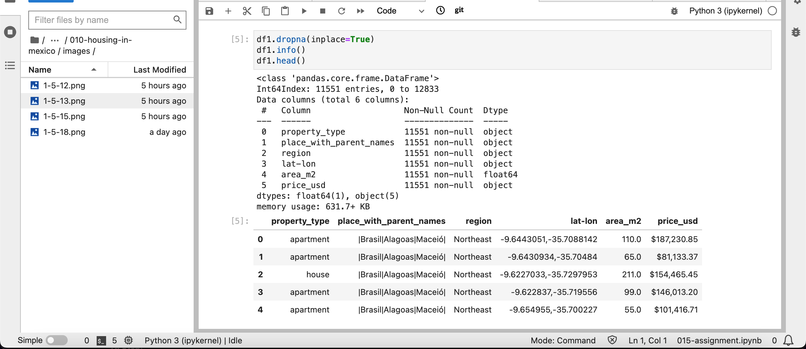
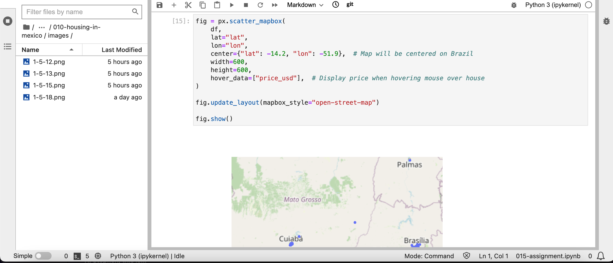
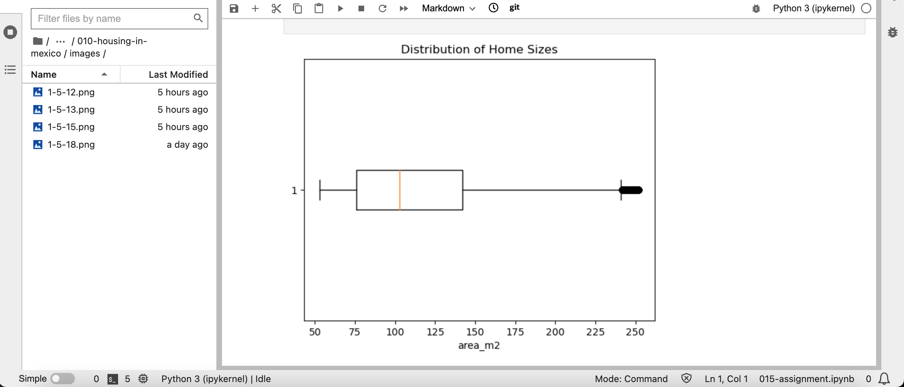

# Housing Analysis in Brazil 🇧🇷

This project entails a comprehensive data analysis of the housing market in Brazil. Utilizing Python within a Jupyter notebook environment, the analysis incorporates various libraries such as Matplotlib, Pandas, and Plotly to process, clean, and visualize the data. The primary focus is on understanding regional trends, pricing dynamics, and property attributes.

## Data Preparation and Cleaning

The dataset comprises two distinct files, each requiring individual treatment before concatenation into a unified dataset. Several preprocessing steps were undertaken, including the removal of empty rows, the creation of new columns to enhance analysis, and the elimination of columns with irrelevant or inappropriate data. Additionally, a currency conversion was implemented to standardize pricing in USD for enhanced comparability.

## Analysis Highlights
Summary Statistics
One of the key analyses conducted was the computation of summary statistics, particularly focusing on the relationship between property area and price.

##### Data Exploration
A variety of visualization techniques were employed to gain insights into the Brazilian real estate market. These include:
- Map Visualization: Geospatial representation to discern regional disparities.

- Histogram of Property Prices (USD): Illustrates the distribution of property prices in USD, aiding in understanding pricing patterns.

- Boxplot of Property Area: Visualizes the spread of property sizes, facilitating comparisons across different segments.

- Regional Price Comparison: Properties were grouped by region, and mean prices were depicted using a bar chart, enabling a comparative analysis of pricing trends across different regions.

## Conclusion
Through the application of advanced data analysis techniques and visualization tools, this project provides valuable insights into the Brazilian housing market. The findings contribute to a better understanding of regional variations, pricing dynamics, and property characteristics, thereby assisting stakeholders in making informed decisions within the real estate sector.

