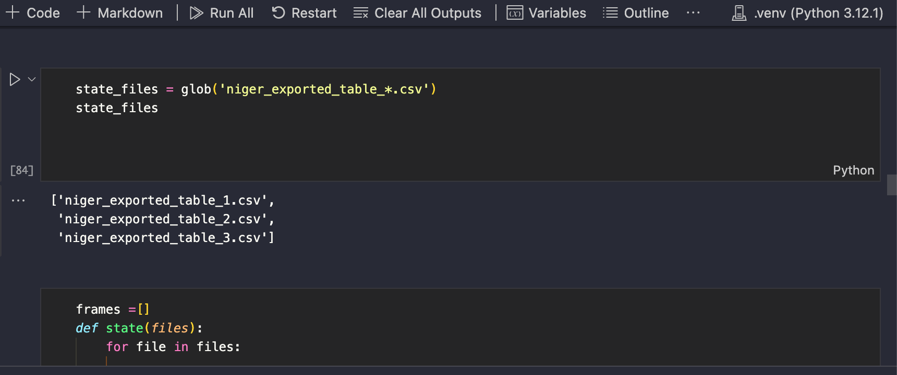

# Project Documentation: Data of Niger State Residents, Nigeria.

## Introduction

This project involves the data processing and analysis of information on the people of Niger State, Nigeria. The primary focus is to extract and clean data pertaining specifically to female residents. The data is provided across several sheets with varying column structures, necessitating significant preprocessing to standardize and consolidate the information.

## Data Overview

The dataset consists of the following columns:
- **First Name**: The given name of the individual.
- **Last Name**: The family name of the individual.
- **Phone Number**: Contact phone number of the individual.
- **State**: The state of residence (in this case, always Niger).
- **LGA**: Local Government Area of residence.
- **Gender**: Gender of the individual.

## Objectives

1. **Filter Data for Females**: Extract only the records corresponding to female individuals.
2. **Standardize Columns**: Ensure all sheets have the same column names and structure.
3. **Clean Data**: Remove rows with missing phone numbers.
4. **Concatenate Data**: Combine the cleaned and standardized data from multiple sheets into a single dataset.
5. **Sorting Data in Alphabetical Order**: The combine and cleaned data (single dataset) was later sorted in Alphabatical order using the LGA column.

## Tools and Libraries

The following tools and libraries were used in this project:
- **Pandas**: For data manipulation and analysis.
- **Glob**: For reading files with specific naming patterns.

## Process

### Step 1: Read Data from Files

The data was spread across four files, which came in two different naming patterns. The `glob` module was utilized to read three of the files into memory as they shared a common naming pattern.

```python
import pandas as pd
from glob import glob


# Read single csv file  and others with a common naming pattern

df_minna = pd.read_csv('XXX com 1.csv', low_memory=False )

state_files = glob('niger_exported_table_*.csv')
state_files
```




### Step 2: Standardize Columns

Each sheet had different column structures, so it was necessary to standardize the columns across all sheets. The columns were aligned to ensure consistency before concatenation.

```python
# Standardize column names for all data frames
for df in data_frames:
    df.columns = ['First Name', 'Last Name', 'Phone Number', 'State', 'LGA', 'Gender']
```

### Step 3: Filter for Females

The dataset was filtered to retain only the records of female individuals.

```python
# Filter data for females
female_data_frames = [df[df['Gender'] == 'Female'] for df in data_frames]
```

### Step 4: Clean Data

Rows with empty phone numbers were dropped to ensure the quality of the data.


```python
# Drop rows with empty phone numbers
df_minna.dropna(subset=["Phone Number"])
df_minna.info()
```

### Step 5: Writing a function for the second data set

```python
def state(files):
    for file in files:

        #Reading CSV files from glob
        df = pd.read_csv(file, low_memory=False)

        #Dropping the "polling_unit" and "rac" columns
        df.drop(columns=["polling_unit", "rac"], inplace=True) 


        #Renaming columns to match columns of existing data
        (df.rename(columns=  
                   {"first_name": "First Name",
                    "last_name": "Last Name",
                    "gender": "Gender",
                    "mobile_number":"Phone Number",
                    "lga": "LGA",
                    "state": "State"}, inplace=True )

        )

        #Dropping "Phone Number" columns with NaN
        df.dropna(subset= ["Phone Number"], inplace=True)


        #Dropping rows that are "Male" in the "Gender" column
        df = df[df["Gender"]== "Female"]


        #Dropping rows that are 'MUNICIPAL' and 'AROCHUKWU' in the LGA column
        df = df[df["LGA"]!= "MUNICIPAL"]
        df = df[df["LGA"]!= "AROCHUKWU"]


        # #Sorting LGA in ascending order
        # df["LGA"].sort_values()


        frames.append(df)
    return df
state(state_files)

```


### Step 6: Concatenate Data

The cleaned and standardized data frames were concatenated into a single dataset.

```python
# Concatenate data frames
df = pd.concat([frames[0], frames[1], frames[2], df_minna])
print(df.info())
print(df.shape)
print(df.head())
df.tail()
```


### Step 7: Sorting Data
```python
#Sorting LGA in ascending order
df = df.sort_values("LGA")
df.head()
```


### Step 8: Saving Final Data

The final cleaned and filtered dataset was saved to a new file.

```python
# Save the final data to a new file
df.to_csv("Niger Female.csv", index=False)

```

## Conclusion

This project successfully processed the data of Nigerlites, focusing on female residents. The data was read from multiple files, standardized, filtered, cleaned, and concatenated to produce a final consolidated dataset.
