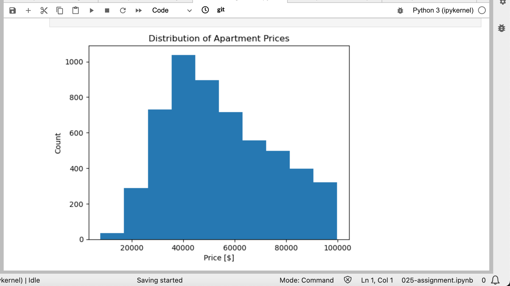
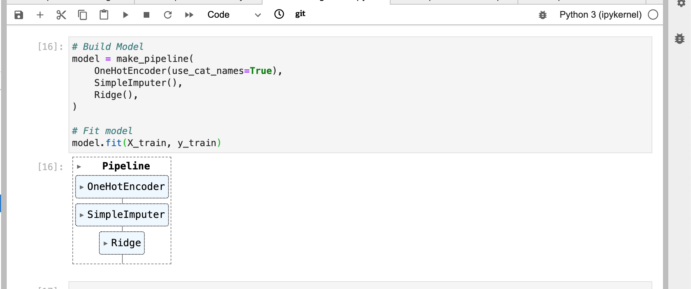

# Predicting Apartment Prices in Mexico City 🇲🇽

This data science and analysis project aims to predict apartment prices in Mexico City. The project utilizes various Python libraries for data manipulation, visualization, and modeling.

Libraries used:
- **glob**: For file handling and retrieving file names.
- **pandas**: For data manipulation and analysis.
- **matplotlib.pyplot**: For creating static visualizations like histograms and scatter plots.
- **plotly.express**: For interactive visualizations.
- **seaborn**: For statistical data visualization.
- **category_encoders**: For encoding categorical variables.
- **sklearn**: For machine learning tasks such as data preprocessing, modeling, and evaluation.

Tasks performed:

1. **Wrangle Function**: A function is created to preprocess the data, including filtering apartments in Mexico City, removing outliers, creating new columns for latitude and longitude, creating a borough feature, handling missing values, dropping irrelevant columns, and addressing potential issues like leakage and multicollinearity.

2. **File List**: Used glob to create a list of files.

3. **Histogram**: Created a histogram to visualize the distribution of apartment prices.

4. **Scatter Plot**: Plotted a scatter plot to explore the relationship between apartment price and size.

5. **Mapbox Scatter Plot**: implemented to show apartment locations with prices represented by colors using Mapbox.

6. **Heat Map**: Created a Heat Map using Seaborn to visualize and eliminate multicolinearlity.

7. **Pipeline**: Created a pipeline named 'model' containing data transformers and a predictive model, then fitted the model to the training data.

8. **Feature Importance Visualization**: Created a horizontal bar chart to display the ten most influential coefficients for the model, providing insights into feature importance for predicting apartment prices.

Overall, this project encompasses data preprocessing, exploratory data analysis, model building, and feature importance analysis to predict apartment prices in Mexico City.